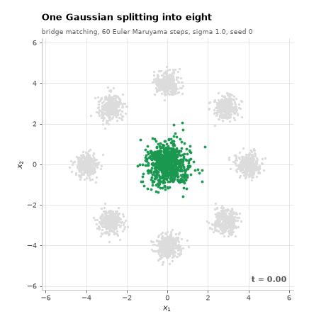
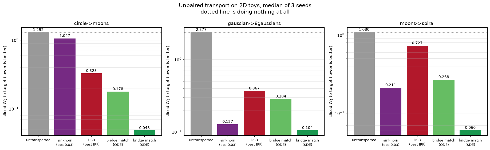
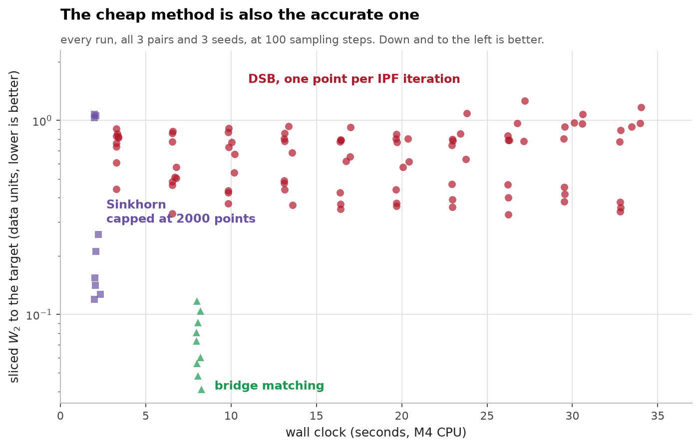
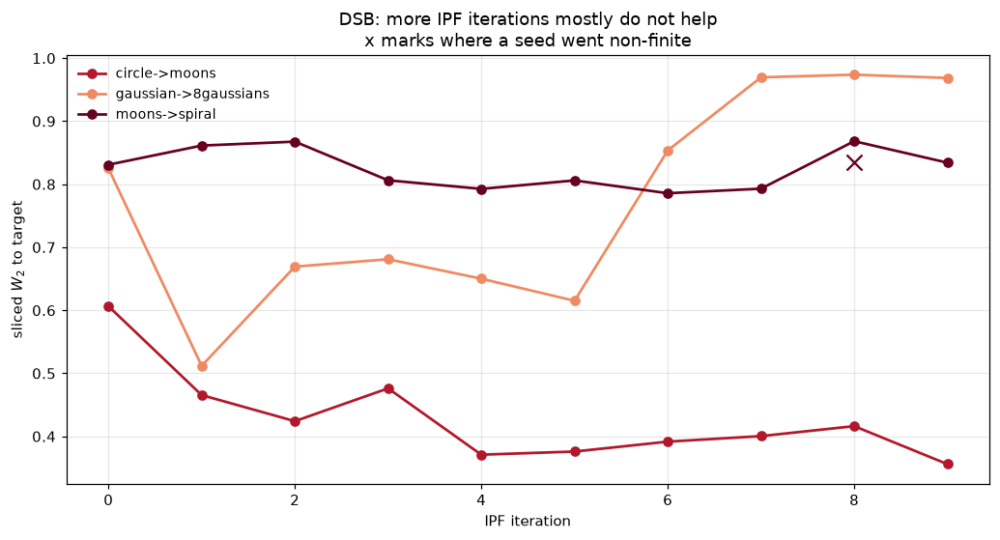
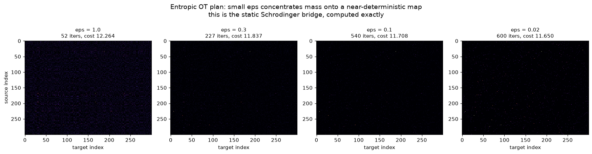
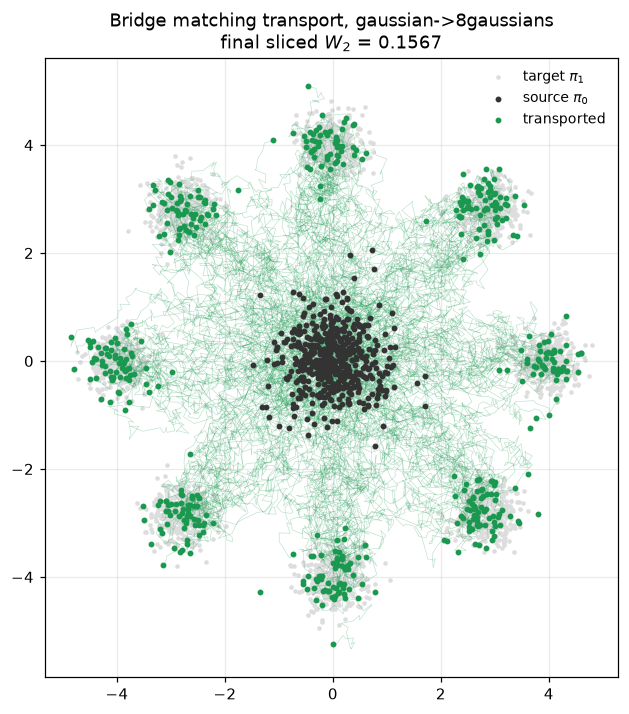

# schrodinger-bridge-from-scratch

Entropic optimal transport, diffusion Schrodinger bridges by iterative
proportional fitting, and bridge matching. Built from the papers and compared at
matched compute, on a laptop CPU.

The question this repo exists to answer is whether full DSB pays for itself
against the simulation free method that replaced it. On these toys it does not,
and the gap is large enough that it is worth writing down.



## What the problem is

Diffusion models transport a Gaussian to your data. The Schrodinger bridge
problem is the general version: given two arbitrary distributions and a
reference process, find the process closest in KL to the reference that
transports one to the other exactly. It is the dynamic form of entropic optimal
transport, and standard diffusion is a degenerate special case where one end
happens to be Gaussian.

Three ways to attack it, all implemented here:

**Sinkhorn** solves the static problem directly. Given a cost matrix and a
regularisation eps, find the coupling minimising transport cost minus eps times
entropy. It is exact, it is the ground truth everything else is checked against,
and it does not scale past a few thousand points because it needs the full
cost matrix.

**DSB** solves the dynamic problem by iterative proportional fitting. Two
networks, alternating: fit a backward drift on trajectories from the forward
process, then a forward drift on trajectories from the backward one, and repeat.
Every outer iteration needs a full simulation pass plus a full training pass.

**Bridge matching** replaces the straight interpolant of flow matching with a
Brownian bridge, which is the reference process conditioned to hit both
endpoints. One network, one regression, no alternating iterations, no simulation
during training.

## Results

Sliced Wasserstein-2 to the target, median of 3 seeds, 8000 points per side:

| pair | doing nothing | Sinkhorn (eps 0.03) | DSB (best IPF) | bridge match (ODE) | bridge match (SDE) |
|---|---:|---:|---:|---:|---:|
| circle to moons | 1.292 | 1.057 | 0.328 | 0.178 | **0.048** |
| gaussian to 8 gaussians | 2.377 | **0.127** | 0.367 | 0.284 | 0.104 |
| moons to spiral | 1.080 | 0.211 | 0.727 | 0.268 | **0.060** |



Wall clock on the same CPU, per pair:

| method | time | networks | notes |
|---|---:|---:|---|
| Sinkhorn | 2.0 s | 0 | but capped at 2000 points by the cost matrix |
| bridge matching | 8.0 s | 1 | one regression, no simulation while training |
| DSB | 33 s | 2 | 10 IPF iterations, each simulating and training |

Bridge matching is four times cheaper than DSB and between two and twelve times
more accurate on every pair. That is the headline and it is not close.



## DSB does not improve with more iterations

IPF is supposed to converge. Mine does not, and this is the most interesting
negative result in the repo.



Median sliced W2 by IPF iteration:

| pair | ipf 0 | 1 | 2 | 3 | 4 | 5 | 6 | 7 | 8 | 9 |
|---|---:|---:|---:|---:|---:|---:|---:|---:|---:|---:|
| circle to moons | 0.607 | 0.466 | 0.424 | 0.476 | 0.371 | 0.376 | 0.392 | 0.400 | 0.416 | 0.356 |
| gaussian to 8 gaussians | 0.825 | 0.512 | 0.669 | 0.681 | 0.650 | 0.615 | 0.854 | 0.970 | 0.974 | 0.969 |
| moons to spiral | 0.831 | 0.861 | 0.868 | 0.806 | 0.793 | 0.806 | 0.786 | 0.793 | 0.868 | 0.834 |

One pair gets slowly better, one gets clearly worse after iteration 5, and one
never really moves. Two of ninety DSB runs went non finite entirely, both on
moons to spiral at iterations 8 and 9.

The mechanism is that each network trains on trajectories produced by the other,
so any error in one becomes training data for the next. Nothing corrects it, and
on the pair where it compounds fastest the whole loop walks off. The internal
regression losses fall smoothly the whole time, from 18 down to about 2.5, which
is what makes this hard to notice: the thing being minimised is going down while
the thing you care about is going up.

**What I am not claiming.** This is my implementation of DSB, not DSB. I found
three real bugs in it (below) and there may be a fourth. Published DSB results
are better than this. What I can say is that getting DSB to work took me
substantially more effort than bridge matching, which took one function and
worked first time, and that matches what the literature moved to.

## The static bridge

Sinkhorn is worth looking at directly, because the plan is the object everything
else approximates. As eps shrinks the coupling concentrates from a diffuse blur
onto a near deterministic map:



It is solved in log space. The direct version multiplies exp(-C/eps) and
underflows to exactly zero for any eps below about 0.05 on these toys, which
shows up as a plan full of NaN after the first iteration.

Note the one row where Sinkhorn does badly: circle to moons, 1.057 against a
do nothing baseline of 1.292. Entropic plans are spread out by construction, and
the barycentric projection averages that spread, so every source point maps to
something near the middle of its options. When the target is two separated
crescents the middle is empty space. That is a real limitation of turning a
coupling into a map, not a tuning failure.

## Transport paths



## What I got wrong

Three bugs, and the order matters because each one hid the next.

**One. The backward drift was reversed twice.** A DSB backward drift is fit
against a target arranged so that stepping with positive dt moves backward in the
trajectory index. The reversal is already inside the target. I also integrated it
with a negative dt, which reverses again. Reversing a Brownian process onto its
own starting distribution scored 4.94 that way against a do nothing baseline of
0.56, and the IPF loop diverged to a forward loss of 1.5e11. With the sign fixed
the same test gives 0.072.

**Two. The forward network was trained against mirrored time labels.** After
fixing the sign the losses fell smoothly and the transport was still worse than
doing nothing. A forward trajectory has t_k = k dt so the next state sits at
t_k + dt, but a reverse trajectory has t_k = 1 - k dt so the next state sits at
t_k - dt. I used plus in both cases. The network learned the right field indexed
by the wrong clock, which the loss cannot see.

**Three. My distance metric was wrong, and it was the reason I doubted the other
two fixes.** Sliced Wasserstein sorts both point clouds along random directions
and compares them. Comparing element i to element i is only correct when the two
sets are the same size. With 4000 samples against 8000 it compares all of the
first against the lowest half of the second, and reports a large distance between
two samples of the same distribution. A bridge matching run whose output matched
the target mean to 0.01 and its standard deviation to 0.014 was scored at 3.04. I
went looking for a transport bug that did not exist. Both are now interpolated
onto a shared quantile grid, and there is a test that runs 500 against 8000.

The lesson I actually take from this is that the metric deserved a test before
any method did. Three of the four things I tested first were fine.

## Running it

```bash
python -m venv .venv && source .venv/bin/activate
pip install -r requirements.txt
```

```bash
python -m pytest tests/ -q
```

```bash
python -m bench.experiment
```

```bash
python -m bench.figures
```

The experiment takes about 7.5 minutes on an M4 CPU and writes
`results/transport.csv`. Figures read that file and never re run an experiment,
so a plot cannot disagree with a number in this README.

## Layout

```
sb/metrics/      sliced W2 on a shared quantile grid, marginal error
sb/ref/toys.py   2D source and target pairs
sb/sinkhorn/     log domain entropic OT, the static bridge
sb/dsb/          IPF with two drift networks
sb/bridge_matching/  Brownian bridge interpolant, simulation free
sb/sde.py        Euler Maruyama, forward and backward
sb/models.py     drift MLP with sinusoidal time embedding
bench/           the experiment and the figures
tests/           22 tests
```

## Sources

- **Cuturi. Sinkhorn Distances: Lightspeed Computation of Optimal Transport. NeurIPS 2013.** [arXiv:1306.0895](https://arxiv.org/abs/1306.0895) The entropic regularisation and the fixed point iteration.
- **Peyré, Cuturi. Computational Optimal Transport. FnT ML 2019.** [arXiv:1803.00567](https://arxiv.org/abs/1803.00567) The log domain stabilisation used here, and the barycentric projection caveat.
- **De Bortoli, Thornton, Heng, Doucet. Diffusion Schrödinger Bridge with Applications to Score-Based Generative Modeling. NeurIPS 2021.** [arXiv:2106.01357](https://arxiv.org/abs/2106.01357) DSB and the IPF scheme. The discrete time reversal target is theirs.
- **Shi, De Bortoli, Campbell, Doucet. Diffusion Schrödinger Bridge Matching. NeurIPS 2023.** [arXiv:2303.16852](https://arxiv.org/abs/2303.16852) Bridge matching, and why the alternating scheme can be replaced.
- **Liu, Wu, Ye, Zhu. I2SB: Image-to-Image Schrödinger Bridge. ICML 2023.** [arXiv:2302.05872](https://arxiv.org/abs/2302.05872) The tractable bridge construction that makes the simulation free version work.
- **Léonard. A survey of the Schrödinger problem and some of its connections with optimal transport. 2013.** [arXiv:1308.0215](https://arxiv.org/abs/1308.0215) The link between the Schrodinger problem and entropic OT.
- **Lipman et al. Flow Matching for Generative Modeling. ICLR 2023.** [arXiv:2210.02747](https://arxiv.org/abs/2210.02747) Bridge matching is this with a different interpolant. See [rectified-flow-from-scratch](https://github.com/aghasalim/rectified-flow-from-scratch).

## Methodology

The rules this follows are in [`METHODOLOGY.md`](METHODOLOGY.md). Rule 8, no number
that did not come from a measurement, and rule 14, negative results stay in, are
why the DSB section reads the way it does.

## Author

Aghasalim Mustafazada, third year AI student at Howest, Belgium.

<p align="center">
  <a href="https://github.com/aghasalim">
    </a>
  <a href="https://www.kaggle.com/aghasalimmustafazada">
    </a>
  <a href="https://linkedin.com/in/mustafazada">
    </a>
  <a href="https://orcid.org/0009-0001-8746-4582">
    </a>
</p>

## License

MIT, see [LICENSE](LICENSE).
